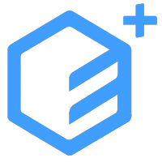
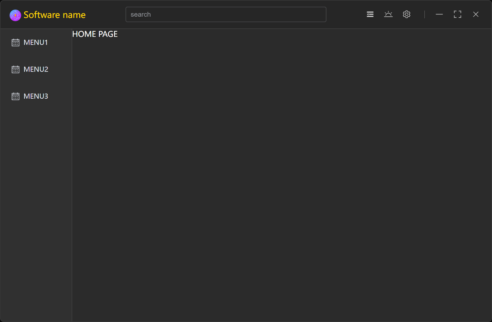
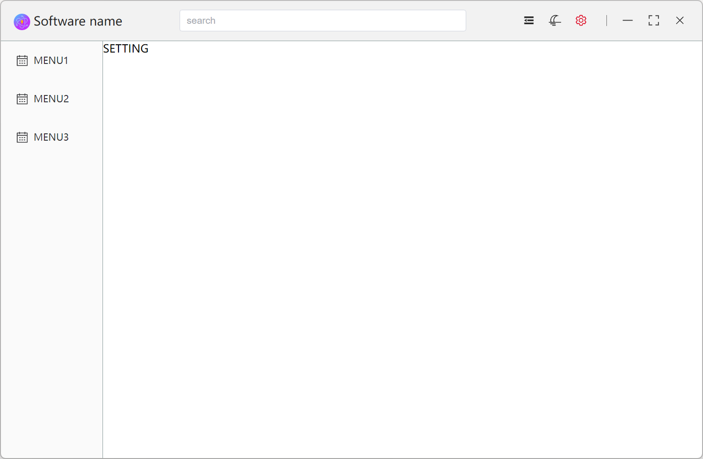

# evve-desktop-starter

[](https://www.electronjs.org/)
[](https://vitejs.dev/)
[](https://vuejs.org/)
[](https://element-plus.org/)

🥳 Really simple <u>[`Electron`](https://www.electronjs.org/)</u> + <u>[`Vite`](https://vitejs.dev/)</u> + <u>[`Vue`](https://vuejs.org/)</u> + <u>[`ElementPlus`](https://element-plus.org/)</u> desktop gui quick start template.  
💖 Click on the underlined section above to view relevant technical documents

## Features

📦 Out of the box  
🎯 Based on the official [Circularorbit/electron-vite-vue-element-plus](https://github.com/Circularorbit/electron-vite-vue-element-plus.git)
🌱 Extensible, really simple directory structure  
💪 Support using Node.js API in Electron-Renderer  
🔩 Support C/C++ native addons  
🖥 It's easy to implement multiple windows

## Quick Setup

```sh
# clone the project
git clone https://github.com/Circularorbit/evve-desktop-gui-template.git

# enter the project root directory
cd evve-desktop-gui-template

# (optional) check out .npmrc file mirror source settings for you 
cat .npmrc

# install dependency
npm install

# develop
npm run dev

# build installer package
npm run build
```

## Display
default includes two theme modes



## Directory

```diff
+ ├─┬ electron
+ │ ├─┬ main
+ │ │ └── index.ts      entry of electron-main
+ │ └─┬ preload
+ │   └── index.ts      entry of preload-scripts
+ │ 
+ ├── release           store application build results
+ │ 
+ ├─┬ src
+ │ ├── assets          store static resource file, such custom light/dark theme and image file, 
+ │ ├── components      store independent and reusable components vue file
+ │ ├── router          store router config file
+ │ ├── store           store pinia config file
+ │ ├── views           store custom develop views
+ │ ├── App.vue         entry of vue application
+ │ ├── main.ts         entry of Electron-Renderer
+ │ └── vite-env.d.ts   entry of Preload-Scripts function statement
+ │ 
+ ├── index.html
+ ├── package.json
+ └── vite.config.ts
```

## Read more development documents
[vue-router](https://router.vuejs.org/zh/) is the official client-side routing solution for Vue.  
[pinia](https://pinia.vuejs.org/zh/introduction.html) is a store library for Vue, it allows you to share a state across components/pages

## FAQ

- [C/C++ addons, Node.js modules - Pre-Bundling](https://github.com/electron-vite/vite-plugin-electron-renderer#dependency-pre-bundling)
- [dependencies vs devDependencies](https://github.com/electron-vite/vite-plugin-electron-renderer#dependencies-vs-devdependencies)
